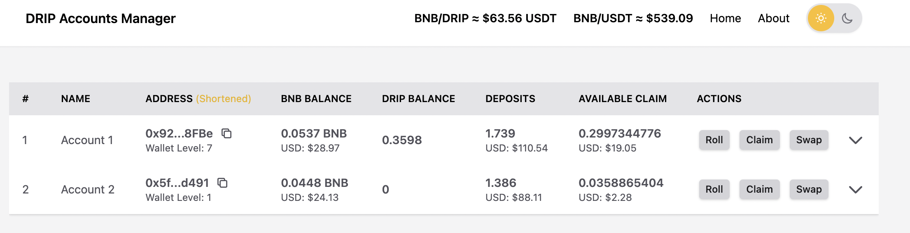
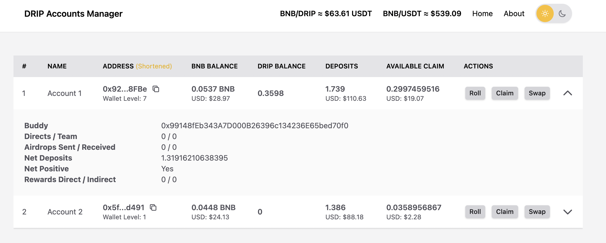
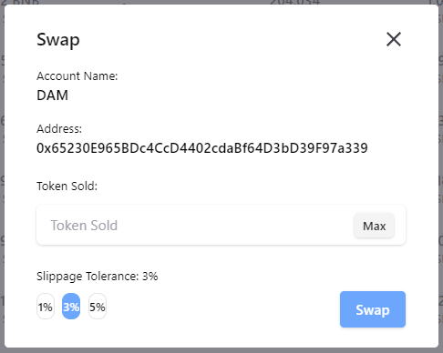

# drip-account-manager

Drip Account Manager helps you manage your DRIP accounts. 
It provides a simple and easy to use user interface to interact with the DRIP smart contracts without the need of using wallets such as metamask.

### How does it work?
1.  A single json file is used define all your accounts. 
2. You must provide all the necessary details in order for the application to pull and perform smart contract interaction. 
3. A accounts-sample.json is provided as a sample template. 

### Screenshots




### How do I run it?
1. Clone the repository
2. Create a accounts.json to define the accounts you want to manage
3. Put the accounts.json in the data folder.
4. install node & yarn
```bash
# install nvm (https://github.com/nvm-sh/nvm#installing-and-updating)
curl -o- https://raw.githubusercontent.com/nvm-sh/nvm/v0.39.1/install.sh | bash
# go to project, open terminal, install node version (this installs node version defined in .nvmrc)
nvm install
nvm use
# install yarn via npm
npm install -g yarn
yarn -v
```
5. run drip-manager
```bash
# make sure all dependencies are installed
yarn install
# run drip-manager
yarn dev
# audit dependencies (optional)
yarn audit
```
6. application is now running on http://localhost:3000/
7. Open a new terminal to run drip-manager-bot
8. cd drip-manager-bot
```bash
# make sure all dependencies are installed
yarn install
# run drip-manager-bot (make sure that the drip-manager is running)
yarn start-bot
# audit dependencies (optional)
yarn audit
```

### Security
1. The accounts.json file never leaves your local machine.
2. The details defined in the accounts.json is never sent to some server to be stored. 
3. All the source codes are publicly available here on Github. 

### Bot Strategies
1. alternatingRollClaimStrategy
- Perform alternataing roll & claim each time the dollar threshold is met.
2. alternatingRollClaimSwapStrategy
- Perform alternataing roll & claim each time the dollar threshold is met.
- Each time a claim is executed, it also performs swap or selling of the token for BNB.
3. alternatingRollClaimSwapPercentageStrategy
- Perform alternataing roll & claim each time the dollar threshold percentage (%) is met.
- Each time a claim is executed, it also performs swap or selling of the token for BNB.
4. alternatingRollClaimSwapRatioPercentageStrategy
- Perform roll & claim each time the dollar threshold percentage (%) is met.
- Each time a claim is executed, it also performs swap or selling of the token for BNB.
- Roll / Claim action is based on rollClaimRatio 
- Example: "rollClaimRatio": 2, // performs 2 roll, 1 claim/swap 
5. continuousRollStrategy
- Perform roll each time the dollar threshold is met.
6. continuousRollPercentageStrategy
- Perform roll each time the dollar threshold percentage (%) is met.
- Also performs automatic claim & swap if theres not enough bnb in the wallet.

### Contributing
1.  Fork the repository.
2.  Create a working branch and start with your changes!
3. Commit your update
4. When you're finished with the changes, create a pull request, also known as a PR
5. We will review your PR and merge them. 

### Donation
Wallet address: 0x65230E965BDc4CcD4402cdaBf64D3bD39F97a339
